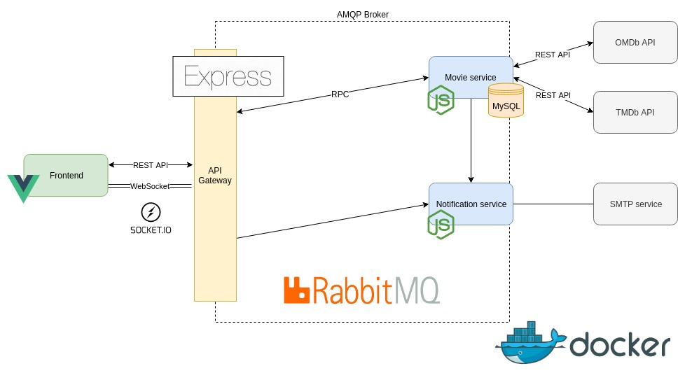
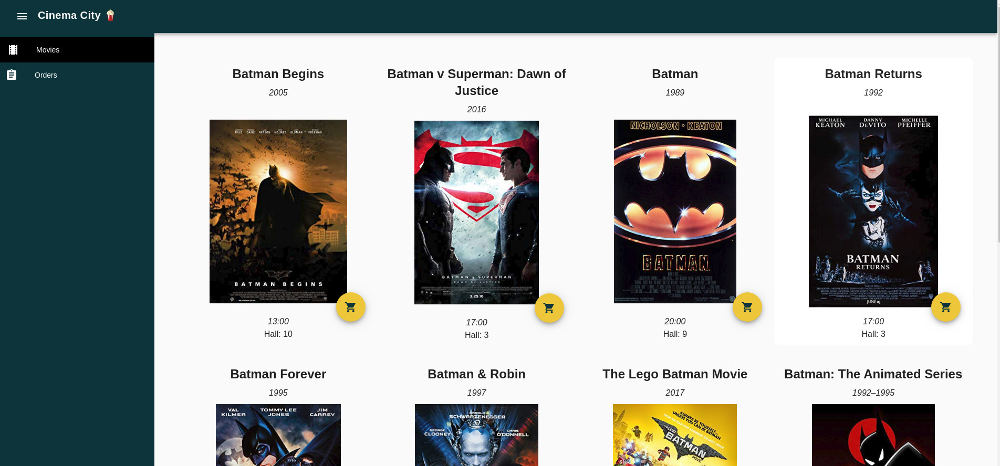
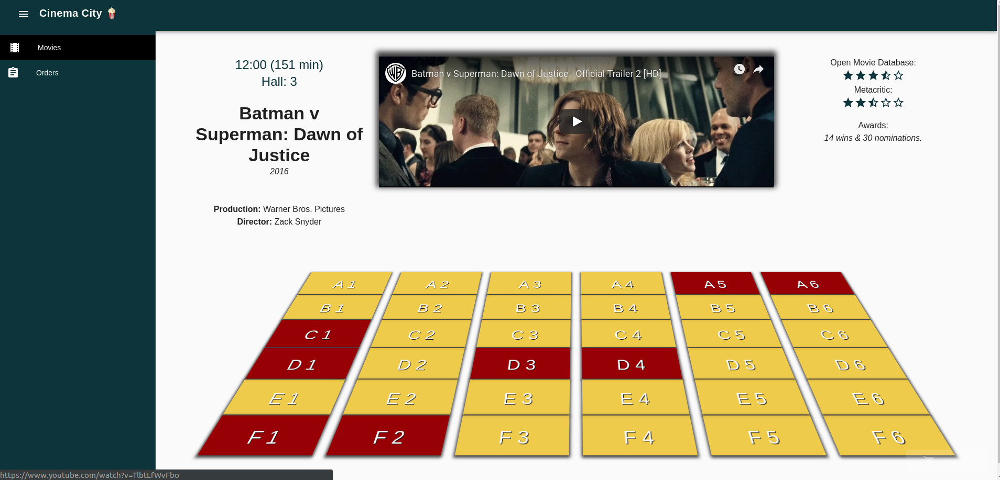
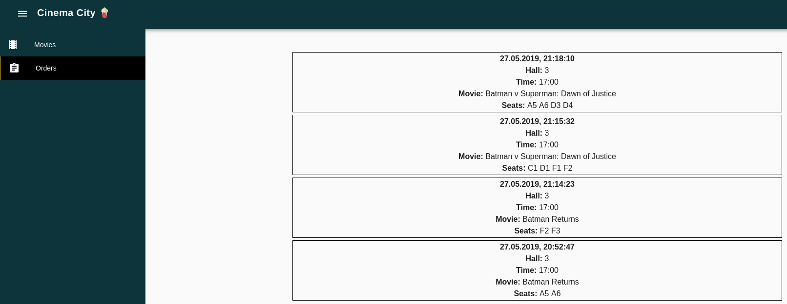
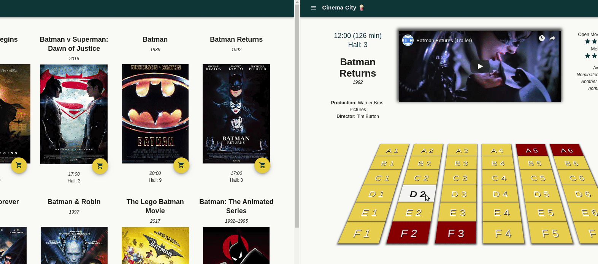
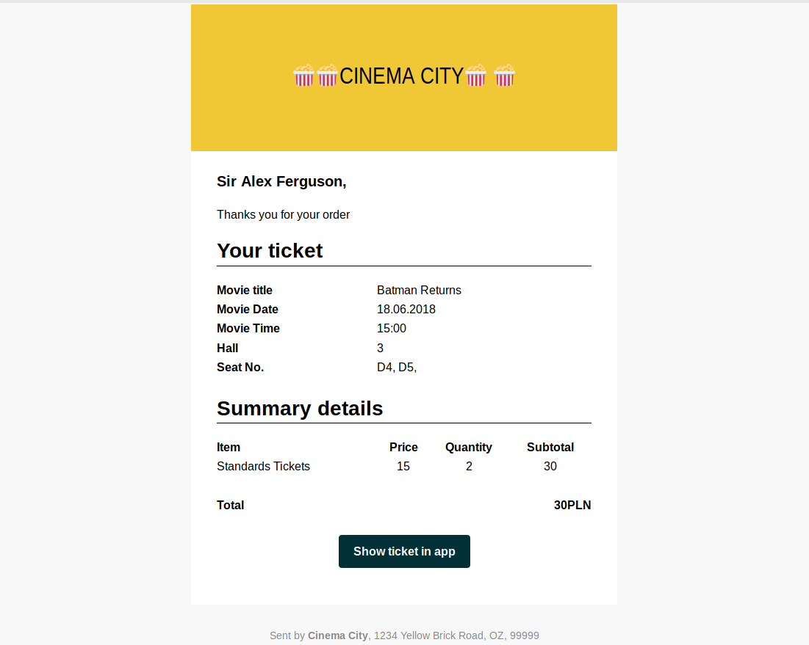

# movie-tickets
An application for booking tickets at the cinema. Implemented in the microservices architecture, using Docker and docker-compose.


## Architecture




## How to run

__Before you start__ 

* Install Docker and Docker Compose
* Set up the connection to database in movie-service/src/config/db.js
* Set AMQP_URL variable in .env file 
(you can use a free 'Little Lemur' plan from [CloudAMQP](https://www.cloudamqp.com/))

```
#start services
docker-compose up -d

#fill db with sample data 
docker exec -it <MOVIE_SERVICE_CONTAINER_NAME> node src/init
```

After starting services web app is available on `http://localhost:80`


## Features

- **Browsing available movies at cinema**
   
   *Details of movies are fetched from external api's [OMDb](http://www.omdbapi.com/) [TMDb](https://www.themoviedb.org/)*
   
   
   
   
   
- **Buying tickets**
    
   *Orders are stored in local database*
   
   
   
   
    

- **Temporary reservations** 

    *Reservations are implemented by using [Socket.io](https://socket.io/) 
    (each movie has own room -> each client subscribe only room/movie event which is actually browsed) 
    and stored in-memory on api-gateway.*
    *To improve api scalability on production, reservations should be stored in distributed DB like [Redis](https://redis.io/)*
    
    
    
- **Sending email with purchased ticket** 

    *Using fake SMTP service [Ethereal](https://ethereal.email/)*

    

# Development

## Commands

```
#rebuild containers
docker-compose build

#list all containers
docker-compose ps -all
```

## Useful links

- how to apply environment variables on container build stage https://github.com/docker/compose/issues/1837#issuecomment-316896858
- docker-compose build args (map vs list) https://github.com/docker/for-mac/issues/2661#issuecomment-370362897
